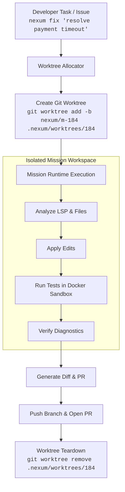

# Nexum Workspaces — Multi-Worktree Mission Architecture

## 1. Overview & Motivation

Today, Nexum executes missions directly against the workspace root where the process was launched. For multi-step tasks, long-running missions, or concurrent autonomous agents, mutating the active working tree interferes with developer focus and prevents parallel execution.

**Nexum Workspaces** elevates git worktrees (`git worktree`) into first-class mission environments:

```text
Nexum Workspaces
 ├── Mission A (bugfix)    → .nexum/worktrees/m-184  (branch: nexum/issue-184)
 ├── Mission B (refactor)  → .nexum/worktrees/m-185  (branch: nexum/refactor-auth)
 └── Mission C (tests)     → .nexum/worktrees/m-186  (branch: nexum/test-checkout)
```

Each mission receives:
1. **Isolated Filesystem**: A clean git worktree checked out to a dedicated feature branch.
2. **Isolated Execution**: Sandboxed Docker container mounted to the worktree path instead of the parent root.
3. **Isolated Agent State**: Dedicated checkpoint (`checkpoint.json`), conversation transcript, and LSP session.
4. **Deterministic Completion**: Verification runs inside the worktree; once verified, the branch is pushed and a PR opened without ever dirtying the developer's working directory.

---

## 2. Architecture & Lifecycle



---

## 3. Implementation Plan & Interfaces

### Workspace Allocator (`src/workspace/worktree.ts`)

```typescript
export interface WorktreeOptions {
  workspaceRoot: string;
  missionId: string;
  branchName: string;
  baseRef?: string;
}

export interface WorktreeHandle {
  path: string;
  branch: string;
  release(): Promise<void>;
}

export async function allocateWorktree(opts: WorktreeOptions): Promise<WorktreeHandle> {
  const targetDir = join(opts.workspaceRoot, ".nexum", "worktrees", opts.missionId);
  const base = opts.baseRef ?? "HEAD";

  // Create isolated branch and worktree directory
  execFileSync("git", ["worktree", "add", "-b", opts.branchName, targetDir, base], {
    cwd: opts.workspaceRoot,
    stdio: "pipe",
  });

  return {
    path: targetDir,
    branch: opts.branchName,
    release: async () => {
      execFileSync("git", ["worktree", "remove", "--force", targetDir], {
        cwd: opts.workspaceRoot,
        stdio: "pipe",
      });
    },
  };
}
```

### Sandbox & LSP Scoping
- `ShellTool` binds `--volume ${worktree.path}:/workspace`.
- `LspManager` spawns a language server session rooted at `worktree.path`.
- All path-contained filesystem tools (`read_file`, `write_file`, `patch`) check boundaries against `worktree.path`.

---

## 4. Safety & Rollback Guarantees
- **Orphan Worktree Pruning**: On process startup, `WorkspaceManager` runs `git worktree prune` to clean any worktrees left behind by sudden system crashes.
- **Zero Host Mutation**: Unfinished or abandoned missions are discarded cleanly without leaving unstaged edits or merge conflicts in the developer's active branch.
